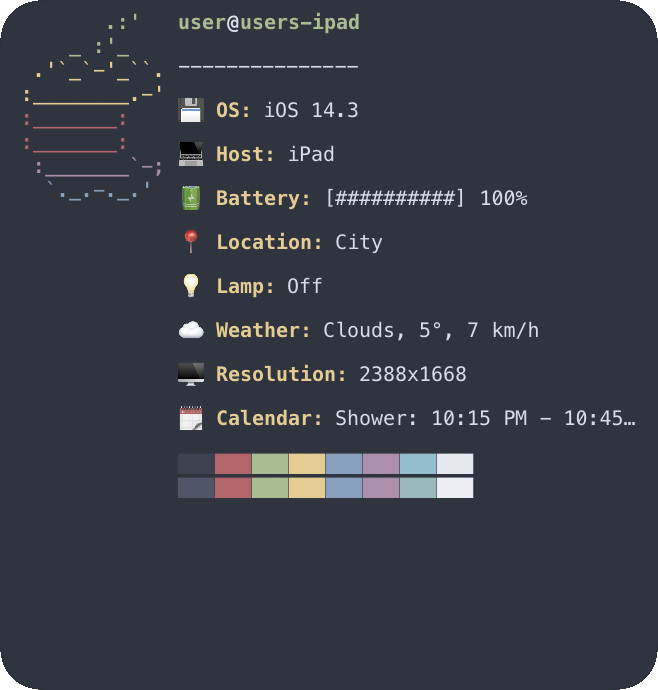
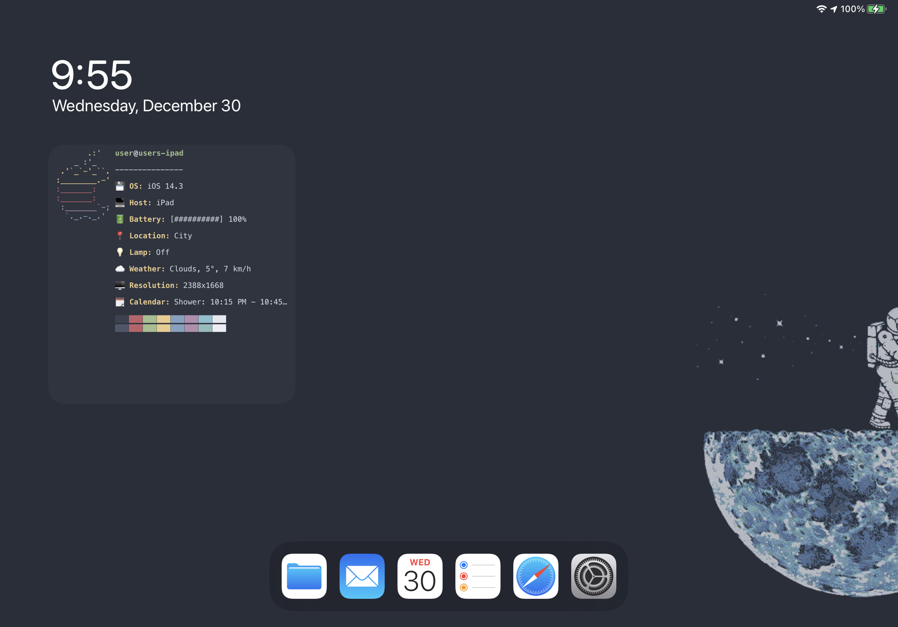

# Scriptable

This repository contains some of my [Scriptable](https://scriptable.app/) scripts.

## iFetch

This module is a configurable widget for your home screen:



<details>
<summary> Fullscreen Preview </summary>



</details>

### Usage

First, download the `iFetch.js` and `BlinkThemes.js` files and put them in your
Scriptable scripts folder. You will also need the `cache.js` file from
[evandcoleman's GitHub](https://github.com/evandcoleman/scriptable/blob/main/scripts/cache.js),
be sure to capitalize the "c" and rename it to `Cache.js` though. Also, if you
plan on using the BlinkThemes module, be sure to read the security note below.

Then, go through the code and read the comments (the lighter text behind the
double slashes: `//`), and replace the empty values as instructed. You should be
able to get everything up and running just by modifying the `THEME` and `CONFIG`
variables.

If you end up adding more stuff such as extra functions to get other pieces of
information, feel free to open a pull request!

## BlinkThemes

This module can be used to get objects containing terminal color themes from the
[Blink Themes GitHub repo](https://github.com/blinksh/themes/).

### Usage

First, download the `BlinkThemes.js` file and put it in your Scriptable scripts
folder.

The module contains two asynchronous functions: `.listThemes()` and
`.hexTheme(theme_name: string)`, and two synchronous functions:
`.colorTheme(hexTheme: object)` and
`.dynamicTheme(colorThemeLight: object, colorThemeDark: object)`.

`.listThemes()` lists all available themes in the Blink Themes repository, and
`.hexTheme()` fetches the theme with the specified name.

**Security Note:** If you plan on using this script, please be aware that the
themes files in the Blink Themes repository are `.js` files and the
`.hexTheme()` method works by downloading the content of the `${theme}.js` file,
and prepending a few lines to the start that define a function that pretends to be
Blink's `t.prefs_.set()` function. This function then adds any values that are
passed to `t.prefs_.set()` to `module.exports`. This means that it is running
all the code in the `${theme}.js` file, so to be safe, you should make sure that
you trust the code in each theme file before you run it call `.hexTheme()` on
it, and you should **never** modify this module to allow insecure downloads over
http.

With the big scary warning out of the way, once you have downloaded
`BlinkThemes.js` and placed it in your Scriptable scripts folder, example usage
is as follows:

```javascript
const BlinkThemes = importModule("BlinkThemes");

console.log(await BlinkThemes.listThemes());
// This statement logs an array object with the names of all available themes.
console.log(await BlinkThemes.hexTheme("Nord"));
/*
 * This statement logs an object containing all properties of the theme as
 * color hex strings.
 */
console.log(BlinkThemes.colorTheme(await BlinkThemes.hexTheme("Nord")));
/*
 * This statement logs an object containing all properties of the theme as
 * Scriptable Color objects.
 */
console.log(
  BlinkThemes.dynamicTheme(
    BlinkThemes.colorTheme(await BlinkThemes.hexTheme("Solarized Light")),
    BlinkThemes.colorTheme(await BlinkThemes.hexTheme("Solarized Dark"))
  )
);
/*
 * This statement logs an object containing all a theme similar to the previous
 * one, except all colors are Scriptable Color.dynamic objects where the light
 * theme colors are made up of the "Solarized Light" theme and the dark theme
 * colors are made up of "Solarized Dark".
 */
```

## Resolver

This module has a single asynchronous method: `.resolveObject(object: object)`
that takes an object as an input and returns the same object, but with all
properties that are promises resolved. It finds all properties that are
promises, then makes use of `Promise.all()` to resolve them all at once, and
finally re-incorporates the resolved values into the original object. This
is a mutating method, and it works recursively on objects with nested properties
of any depth.
